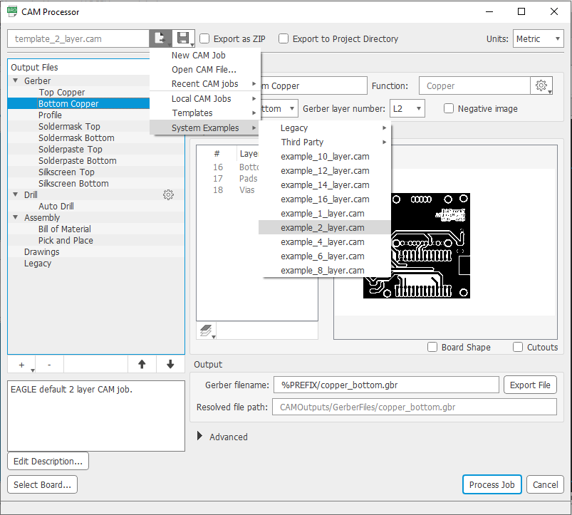
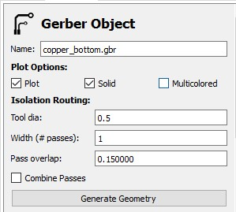
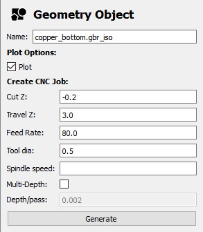

## Guidelines for PCB Manufacturing using a CNC:

This is a general guide how to manufacture a PCB using a CNC. This guideline is also available and being always updated on [LoRa Mesh Github Repo](https://github.com/syk-yaman/lora-mesh/tree/master/PCB/CNC).

### Tools needed/used:

1. CNC machine: [Carvey](http://carvey-instructions.inventables.com/) from Inventables is used for this manual.
2. [FlatCam](http://flatcam.org/) to convert Gerber files to G-code. **Important note:** Only FlatCam v8.5 is compatible with Carvey machines, you can download the older version from [here](https://bitbucket.org/jpcgt/flatcam/downloads/).
3. [Autodesk Eagle](https://www.autodesk.com/products/eagle/overview?term=1-YEAR&tab=subscription) or any PCB CAD software, this method works for all of them!
4. [Easel software](https://easel.inventables.com/) to connect to the Carvey CNC machine, it's a web application without installation. A free plan would probably works fine.

### Steps in Eagle:

After finishing your design and heading to the CAM Processor, choose the `example_2_layer.cam`.

After processing the job, the output files that we are interested in are:

- `copper_bottom.gbr` in `GerberFiles` folder.
- `copper_top.gbr` in `GerberFiles` folder, if it's a two-layers PCB.
- `drill_1_16.xln` in `DrillFiles` folder.

Those files are to be imported to FlatCam.

### Steps in FlatCam:

Basically, it's best to follow this video:

[How NOT to Mill a PCB (except for SMD)](https://www.youtube.com/watch?v=_ak0IJUMBFg)

And for extra information, those videos could also be assisting:

[CNC Milling Double Sided PCBs Using Eagle, FlatCam and GRBL/Candle, Step by Step Detailed Guide](https://www.youtube.com/watch?v=9xczeQMj2dg&t=375s)

[Eagle CadSoft + FlatCam CNC Gcode](https://www.youtube.com/watch?v=p3YzVjpt9Ig&t=794s)

#### Important notes:

1. **Don't forget** to mirror the bottom layer, this is not mentioned in the previous videos.

2. For the Carvey CNC, please change these settings as follows:

Some explanations:

* **Tool dia**: diameter of the cutting tool, to be changed **<u>once for every generated G-code</u>**, this means if you have multiple paths with multiple widths, you need to create a G-code for each separately. 

Some explanations:

- **Cut Z**: this is related to the height between the drilling bit and the PCB, which is according to my experiments should be -0.2. If you notice the drilling bit is not touching the PCB, or the copper layer gets pushed too much, try to adjust this accordingly.
- **Travel Z**: the height of the drill when it moves from one position to another on the PCB. Making this 3 helps in taking less time.
- **Feed Rate**: cutting speed, try to lower it down if you notice the copper edges are not smooth enough.
- **Tool dia**: this is just for display, it was originally set in the previous photo.  

### Steps in Easel:

Basically, just import the generated G-code from FlatCam to Easel. No need for any further settings here, the imported G-code contains all the required settings. Hit Carve and go! - don't forget to watch the first couple of minutes to make sure the CNC is executing the job correctly.

**Note:** try to not fix the PCB from its edges but only from long edges, as doing this would make it curve from the centre thus not having the same height everywhere.

## Further notes to be added after continuing the experiments.