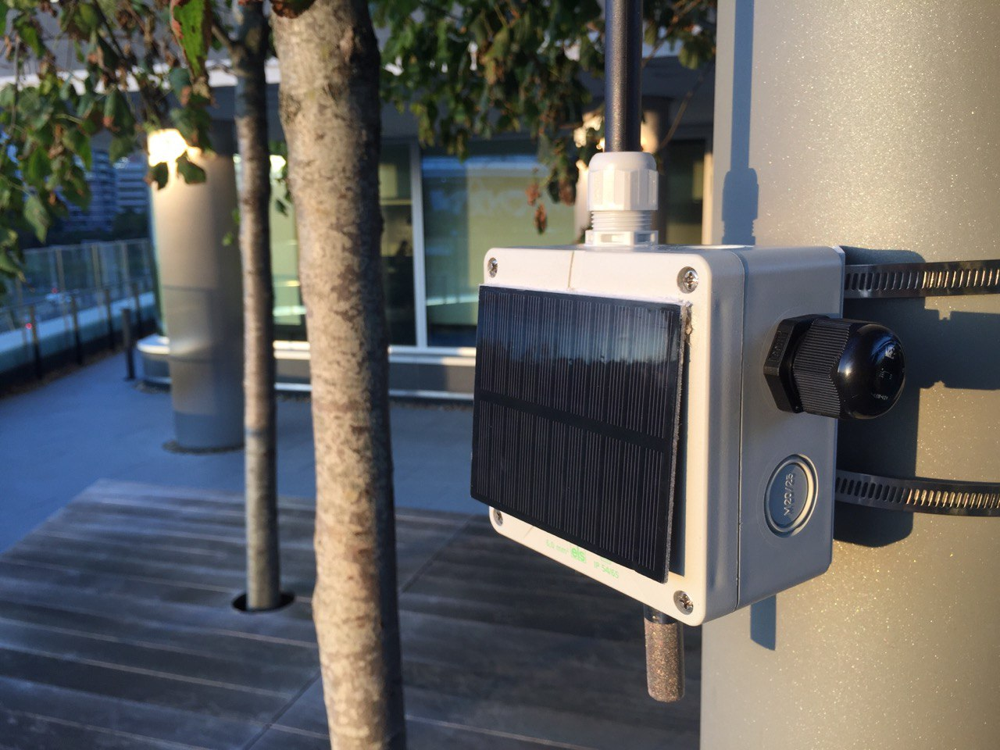
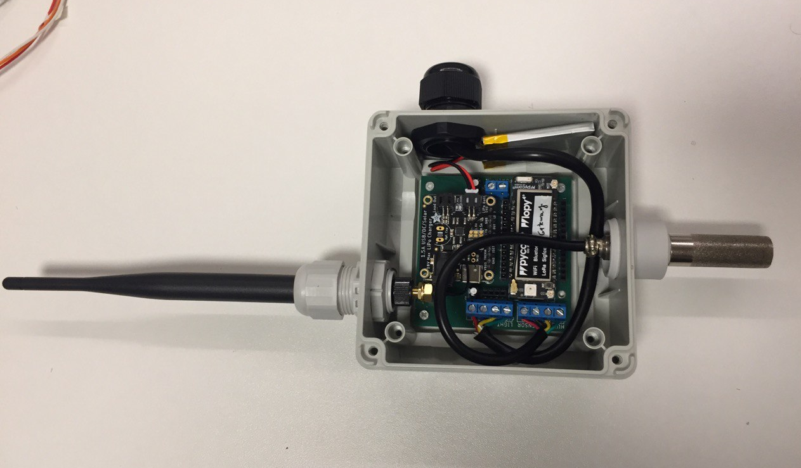

# LoRaMesh: a LoRa mesh network deployed in the Olympic Park, London to sense weather parameters

##### A dissertation for an MSc degree in [Connected Environments](https://connected-environments.org/) at [University College London](https://www.ucl.ac.uk/prospective-students/graduate/taught-degrees/connected-environments-msc), 2022/2023.

This project uses [OpenThread](https://openthread.io/) in LoRa to sense humidity, temperate and light in the Queen Elizabeth Olympic Park (QEOP), London. Sensor data is visualised via web dashboards and projected on a physical Olympic Park table using projection mechanism.

|                          Mesh node                           |                The Data Table                 |
| :----------------------------------------------------------: | :-------------------------------------------: |
|  |  |


## Repository Content Summary

1. **Assets**

   This folder includes the 3D printed parts, namely Fusion360 project files and STLs for the enclosures and the 3D objects for the Data Table.

   - [QEOP 3D Models](</Assets/QEOP 3D models/>)
   - [LoRa Gateway 3D Enclosures](</Assets/3D Enclosures/>)

2. **Code**

   Includes micro-controllers' code, Artificial Intelligence code and various assets used during development.

   - [Lopy4](/Code/Lopy4)

     The main Micro Python code for the Lopy4, which uses Open Thread for LoRa mesh.

   - [Current Analysis](/Code/Current%20Analysis)

     Contains the code, schematic and results for the real-time current analysis circuit.

   - [Heatmap](/Code/Heatmap)

     Web page that visualises CSV data for LoRa heatmap in the Olympic Park.

   - [VR Headset](/Code/VR%20Headset)

     A web page built using [A-Frame](https://aframe.io/) to visualise 360 videos of the QEOP on VR Headsets.

   - [Data Table](</Code/DataTable>)
     The data files projected on the physical map including the final calibrated [Base Map](/Code/DataTable/BaseMap.jpg).

3. **Datasets**

   The final datasets as an outcome of this project. There is a [detailed description](/Datasets/Readme.md) available for each dataset.
   
4. **Docs**

   This folder holds different kinds of documentation and images produced during project life time.

5. **PCB**

   The electronic side of the project. This section contains Eagle files and CAM outputs sent to PCB manufacturers. Also, a [CNC manufacturing tutorial](/PCB/CNC) is available.

6. **Server**

   Docker Composer file for InfluxDB, Grafana and MQTT broker. Basically, all data acquisition is being managed by this Docker image.

7. **Experiments**
   This section includes the multiple experiments done throughout the project.

   - [Experiment #1](/Experiments/Experiment1): First heatmap between LoRa indoor gateway and MRK1310.
   - [Experiment #2](/Experiments/Experiment2): Heatmap between two LoRa nodes (Both MRK1310).
   - [Experiment #3](/Experiments/Experiment3): Heatmap between two LoRa nodes (Both Lopy4), contains a [geolocated dataset](/Experiments/Experiment3/Results/heatmap/Experiment3-LoRa-RSSI-heatmap-QEOP-OPS.csv).
   - [Experiment #4](/Experiments/Experiment4): Contains a [topographic study](/Experiments/Experiment4/GIS%20Stratford) using QGIS, and a [detailed deployment plan](/Experiments/Experiment4/Deployment%20plan) for LoRa nodes in the QEOP.
   - [Experiment #5](/Experiments/Experiment5): Basic Pymesh experiments. 
   - [Experiment #6](/Experiments/Experiment6): Basic MQTT experiments.

   

## Project Overview



<p align="center">

</p>

## Building

### Used components and tools

Hardware:

* [Lopy4](https://www.adafruit.com/product/3689): a dev kit based on ESP32 that has LoRa, Wifi, Sigfox and Bluetooth communication capability.
* [SHT-30](https://www.adafruit.com/product/4099): a weatherproof humidity and temperature sensor.
* [Gravity SEN0562](https://www.dfrobot.com/product-2664.html): a weatherproof light sensor.
* [DC Solar charger (BQ24074)](https://www.adafruit.com/product/4755)
* [Solar panel](https://coolcomponents.co.uk/products/solar-panel-1-watt): 1 Watt, 10x80 cm.
* 2000 mA 3.7v battery

Software:

 - [InfluxDB](https://www.influxdata.com/)
 - [Telegraf](https://www.influxdata.com/time-series-platform/telegraf/)
 - [Grafana](https://grafana.com/)
 - [Docker Compose](https://docs.docker.com/compose/)

All the software applications are packed into one [Docker image](/Server/docker-compose.yml) that you can use easily.

### Hardware PCB and schematic

<p align="center">

</p>

<p align="center">

</p>


## Results

#### The Data Table


 


#### Grafana Dashboard


#### Heatmaps


#### Current consumption analysis

<p align="center">

</p>

<p align="center">

</p>

<p align="center">

</p>

## License


###### The software side is licensed under MIT License

```
MIT License

Permission is hereby granted, free of charge, to any person obtaining a copy
of this software and associated documentation files (the "Software"), to deal
in the Software without restriction, including without limitation the rights
to use, copy, modify, merge, publish, distribute, sublicense, and/or sell
copies of the Software, and to permit persons to whom the Software is
furnished to do so, subject to the following conditions:

The above copyright notice and this permission notice shall be included in all
copies or substantial portions of the Software.

THE SOFTWARE IS PROVIDED "AS IS", WITHOUT WARRANTY OF ANY KIND, EXPRESS OR
IMPLIED, INCLUDING BUT NOT LIMITED TO THE WARRANTIES OF MERCHANTABILITY,
FITNESS FOR A PARTICULAR PURPOSE AND NONINFRINGEMENT. IN NO EVENT SHALL THE
AUTHORS OR COPYRIGHT HOLDERS BE LIABLE FOR ANY CLAIM, DAMAGES OR OTHER
LIABILITY, WHETHER IN AN ACTION OF CONTRACT, TORT OR OTHERWISE, ARISING FROM,
OUT OF OR IN CONNECTION WITH THE SOFTWARE OR THE USE OR OTHER DEALINGS IN THE
SOFTWARE.
```

###### The hardware side is licensed under CERN License

```
This documentation describes Open Hardware and is licensed under the CERN OHL v. 1.2.

You may redistribute and modify this documentation under the terms of the CERN OHL v.1.2. (http://ohwr.org/cernohl). This documentation is distributed WITHOUT ANY EXPRESS OR IMPLIED WARRANTY, INCLUDING OF MERCHANTABILITY, SATISFACTORY QUALITY AND FITNESS FOR A PARTICULAR PURPOSE. Please see the CERN OHL v.1.2 for applicable conditions
```
